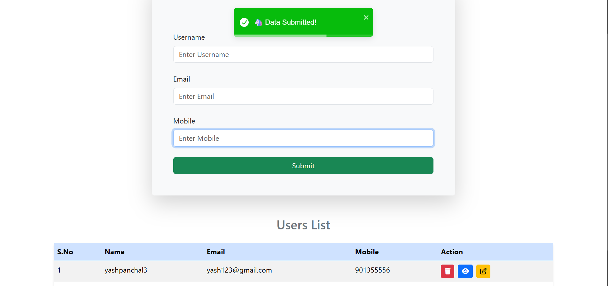
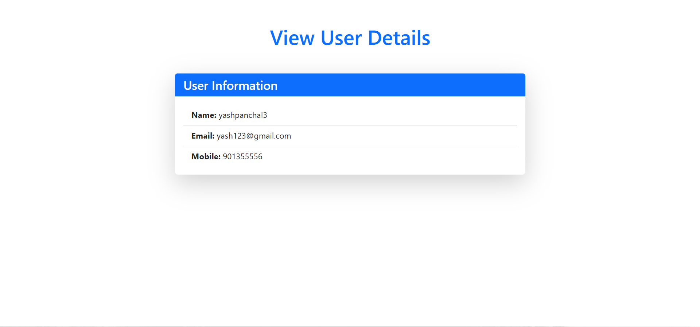
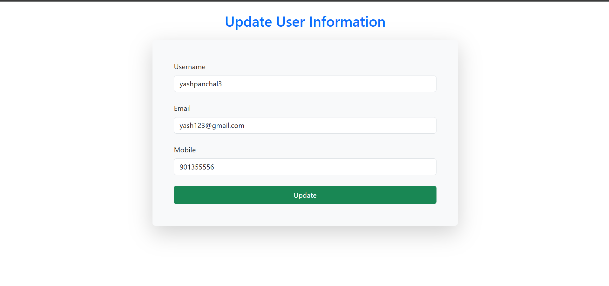

User Management System
This project is a User Management System built using React, Firebase Realtime Database, and React Hook Form. The application allows users to perform CRUD (Create, Read, Update, Delete) operations for managing user data. It leverages Bootstrap 5 for responsive design and React Toastify for notifications.

🚀 Features
Create User: Add new users with username, email, and mobile number.
Read Users: View a list of all users stored in the Firebase database.
Update User: Edit user details and save changes.
Delete User: Remove users from the database.
Responsive UI: Built with Bootstrap 5 for a modern and responsive user interface.
Notifications: Real-time feedback using React Toastify for actions like adding, updating, and deleting data.
🛠️ Technologies Used
React: Frontend library for building user interfaces.
Firebase Realtime Database: NoSQL database for storing user data.
React Hook Form: Easy-to-use form validation library.
Bootstrap 5: Styling and responsive design.
React Toastify: For displaying toast notifications.

🧑‍💻 How to Use
1. Create a New User
Navigate to the homepage.
Fill in the Username, Email, and Mobile fields.
Click the Submit button.
A toast notification will confirm that the user was successfully added.
2. View All Users
The homepage displays a list of all users in a table format.
Each user has options to View, Edit, or Delete.
3. View Single User
Click the View button to see detailed information about a user.
This will redirect you to a page displaying the user's name, email, and mobile number.
4. Update User Details
Click the Edit button to update a user's information.
Modify the fields as needed and click Update.
You'll receive a toast notification confirming the update.
5. Delete a User
Click the Delete button to remove a user.
A confirmation prompt will appear before deleting the user.

📸 Screenshots

